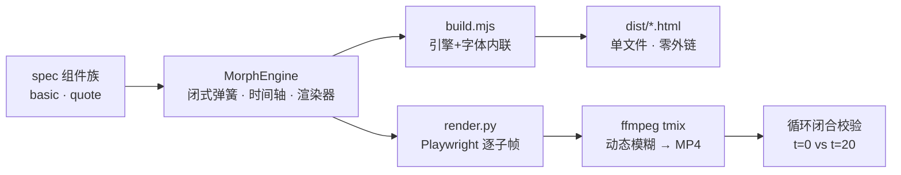

# Sarah · 动效组件库

> 给做产品宣传视频和金融界面的人：每个组件都是**时间的纯函数**——可任意跳转、可逐帧控制、20 秒循环闭合到**零像素差**。不是动效 demo 集，是一套有语法的库。

**[交互展示页](https://cdn.jsdelivr.net/gh/78tyih/sarah-motion@main/docs/showcase.html)**（ZH/EN × 日/夜）· **[组件规格图谱](https://cdn.jsdelivr.net/gh/78tyih/sarah-motion@main/docs/spec-atlas.html)**（数据×6 + 金融×6 实时原型）· [视频总览](https://cdn.jsdelivr.net/gh/78tyih/sarah-motion@main/index.html) · [架构说明](#3-项目结构--architecture) · [复用指南](#4-能复用什么--value--reuse)

| 类型 | 状态 | 入口 |
|---|---|---|
| 动效组件库（JS 引擎 + Python 渲染管线） | 可用 · 基础 11 + 金融 11 已交付；数据 6 + 金融 6 已出规格（[图谱](docs/spec-atlas.html)） | 下方 `本地运行` / [交互展示页](docs/showcase.html) |

---

## 1. 解决什么问题 · Problem

动效 demo 满地都是，但它们是「演给人看的」，不是「可依赖的」：

- **不能跳转** —— 靠 CSS transition / 定时器驱动的动画，只能从头播到尾，没法拖到任意时刻看状态；
- **循环会抖** —— 循环点的残差哪怕 0.03px，都会让 Chrome 把文字栅格化相位挪一个整设备像素，肉眼可见地抖一下；
- **金融组件缺位** —— 报价、杠杆、回放这些交易界面组件，通用组件库从来不管。

同时解决三个：**时间纯函数 + 循环闭合零像素差 + 金融组件族**。

- **适合谁：** 做产品宣传视频的人、做金融/交易界面的人、需要「任意时刻可求值」动画（演示、拖拽回放、Lottie 替代）的人
- **不覆盖：** 数据可视化组件（规划中，见路线图）、无浏览器环境的渲染

## 2. 什么场景，得到什么结果 · Scenario → Outcome

| 场景 | 原来的困难 | Sarah 怎么做 | 结果 |
|---|---|---|---|
| 产品视频需要无缝循环 | 循环点肉眼可见地抖一下 | 末段弹簧 ω24/ζ0.85 快收，残差压到 1e-7 级 | t=0 与 t=20 逐像素比对 **max diff = 0**，附复验命令 |
| 金融界面动效 | 通用库不管报价/杠杆/回放；配色混乱 | Quote Morph 组件族：蓝=操作、绿=涨、红=跌/风险 | 11 个金融组件，杠杆滑块拖过最大值时整个元素拉伸转警示红 |
| 需要拖拽回放/逐帧控制 | CSS 动画没法倒着拖 | `seek(t)` 纯函数，光标按住时值由光标位置直接算出 | 任意时刻可求值、可跳转，拖动即回放 |

### 最小使用路径

**前置：** Node（构建）、Python + Playwright + ffmpeg（渲染）、无账号依赖

```bash
node build.mjs                      # 生成 dist/*.html 单文件（零外链）+ index.html 总览
python render.py components basic   # 11 个基础组件各出一段 MP4 → media/
python render.py loop quote         # 循环闭合校验：max=[0,0,0] pixels>20=0
```

**预期结果：** `dist/` 出单文件 HTML，`media/` 出逐组件 MP4，终端打印闭合校验数值。

## 3. 项目结构 · Architecture



| 模块 | 位置 | 职责 | 边界 |
|---|---|---|---|
| 引擎 | `src/engine.js` | 弹簧闭式解、时间轴、11 个状态渲染器 | 不含构建与渲染逻辑 |
| spec 组件族 | `MorphEngine.engines.basic / .quote` | geometry / windows / 内容渲染 / 光标 | 加组件族 = 加 spec，不动核心 |
| 构建 | `build.mjs` | 字体与引擎内联进模板 | 只产出静态文件 |
| 渲染 | `render.py` | Playwright 逐帧 + ffmpeg tmix（rgb24 直灌不落盘） | 依赖本地浏览器与 ffmpeg |

### 语法（六条硬规则）

1. **每帧从时间计算。** `seek(t)` 是纯函数：无 CSS transition、无定时器、无帧间状态携带。
2. **弹簧是闭式阶跃响应。** `x(t) = x₀ + Σ Δᵢ · step(t − tᵢ)`，多次改目标 = 多个弹簧之和。
3. **拖拽是直接操作。** 光标按住时值由光标位置直接算出；释放时从当前实际位置弹回。
4. **领先边缘与尾随边缘骑不同弹簧。** 领先 ω17 / 尾随 ω13，形状在行程中被拉伸。
5. **内容切换自带进出时机。** 旧内容模糊退出 0.20s，新内容模糊进入 0.25s，不重叠。
6. **循环必须闭合。** 末帧 = 首帧，含光标位置与速度；末段弹簧 ≥0.6s 且 ω ≥ 20。

### 设计 Token

画布 `#F2F0ED` · 墨/纸 `#0A0A0A`/`#FFFFFF` · 强调 `#4F8CFF`（只在激活处）· 涨 `#30A46C` 跌 `#E5484D`（国际口径）· 弹簧 ω 13–17 / ζ 0.60–0.72 · Geist woff2 内联 · 1440×1440 @60fps · 120 BPM（1 拍 = 0.5s）

## 4. 能复用什么 · Value & Reuse

| 可复用部分 | 在哪 | 条件 | 接入方式 |
|---|---|---|---|
| 六条动效语法 | 本 README §3 | 无依赖 | 任何动画项目直接采用为约束 |
| 弹簧闭式解公式 | `src/engine.js` | JS 项目 | 抄公式，替换参数 |
| 渲染管线（Playwright→ffmpeg tmix） | `render.py` | Python + Playwright + ffmpeg | 复制脚本，换模板路径 |
| Quote Morph 金融 spec 族 | `src/engine.js` | 沿用配色纪律 | 作为 spec 参考改写 |
| 设计 token / 120BPM 节拍网格 | 本 README §3 | 无依赖 | 直接取值 |

**建议从这里开始：** 先读六条语法（5 分钟）→ 跑 `node build.mjs` 打开 `dist/` 感受 → 需要视频再上 `render.py`。

## 验证与限制

- **已验证：** 22 个组件 MP4 实际存在于 `media/`；循环闭合命令在 README 中附复验方式（自述 max diff = 0，未独立复核）
- **已知限制：** 渲染需本地浏览器 + ffmpeg；数据可视化组件未交付；**仓库暂无 LICENSE——代码未授权直接复制，方法论可参考**

## 路线图

- [x] 10 状态语法 + 引擎 + 总览页 + 20s showreel
- [x] 每组件独立 MP4 + 视频总览页
- [x] Quote Morph 金融组件（11 状态）+ spec 驱动重构 + 闭合零像素差
- [ ] 数据类 6 组件（Sparkline / Candle / Donut / Gauge / Heatbar / Ticker）— **规格已定稿，含实时原型：[组件规格图谱](docs/spec-atlas.html)**
- [ ] 金融类 6 组件（Quote board / P&L card / Depth bar / Position card / Order toast / **Drawdown meter·新提案**）— 同上
- [ ] 设计 token 页 / 可复制参数面板

---

相关入口：[交互展示页（ZH/EN × 日/夜）](docs/showcase.html) · [组件规格图谱](docs/spec-atlas.html) · [全部组件视频](index.html) · [问题反馈](https://github.com/78tyih/sarah-motion/issues)
